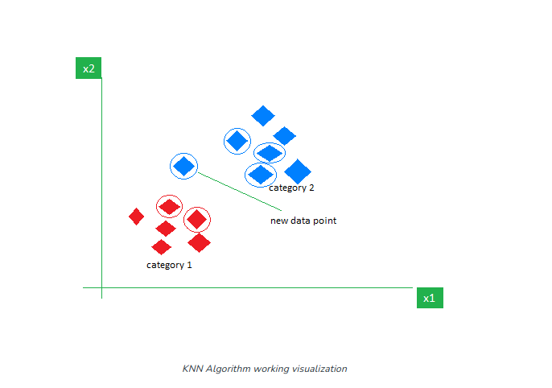
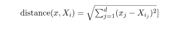
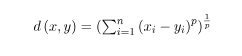
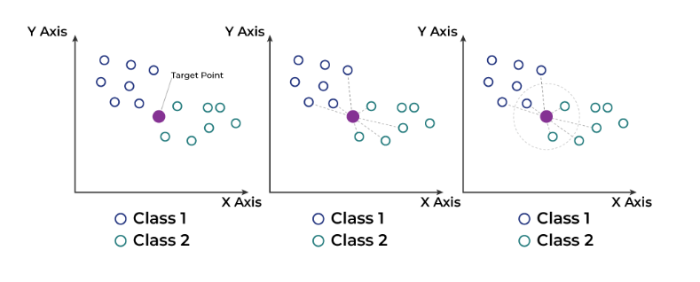
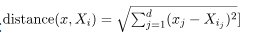

# K-Nearest Neighbor (KNN) Algorithms

The **K-Nearest Neighbors (KNN) algorithm** is a supervised machine learning method employed to takle classification and regression problems


### What is the K-Nearest Neighbors Algorithm?

KNN is one of the most basic yet essential classification algorithms in machine learning. It belong to the [supervised learning](https://) domain and finds intense applicatoin in pattern recognition [data mining](https://), and intrusion detection.

It is widely disposable in real-life scenarios since it it non-parametric, meaning it does not make nay underlying assumptions about the distribution of data (as opposed to other algorithms such as GMM, which assume a [Gaussian Distribution](https://)). We are given some prior data (also called training data), which classifies cordinates into groups identified by an attribute.

Now, given another set of data points (also called testing data), allocate these points to a group by analyzing the training set.




### Intuition Behind KNN Algorithm

If we plot these points on a graph, we may be able to locate some clusters or groups. Now, given an unclassified point, we can assign it to a group by observing what group its nearest neighbors belong to. This means a point close to a cluster of points classified as ‘Red’ has a higher probability of getting classified as ‘Red’.

Intuitively, we can see that the first point (2.5, 7) should be classified as ‘Green’, and the second point (5.5, 4.5) should be classified as ‘Red’.


### Why do we need a KNN algorithm?

(K-NN) algorithm is a versatile and widely used machine learning algorithm that is primarily used for its simplicity and ease of implementation. It does not require any assumptions about the underlying data distribution. It can also handle both numerical and categorical data, making it a flexible choice for various types of datasets in classification and regression tasks. It is a non-parametric method that makes predictions based on the similarity of the data points in a given dataset. K-NN is lesse sensitive to outliers compared to other algorithms.

The K-NN algorithms works by find the K nearest neightbors to a given data point based on a distance metric, such as Euclidean distance. The class or value of the data point is then determined by the majority vote or average of the K neighbors. This approach allows the algorithm to adapt to different patterns and make predictions on the local structure of the data.


### Distances Metrics Used in KNN Algorithm

As we known that the KNN algorithm helps us to identify the nearest points or the groups for a query point. But to determine the closest groups or the nearest points for a query point we need some metric.


#### Euclidean Distance

This is nothing but the cartesian distance between the two points which are in the plane/hyperplace. Euclidean distance can also be visualized as the length ofthe straight line that joins the two points which are into consideration. This metric helps us calculate the net displacement done betwen the two states of an object.



#### Manhattan Distance

Manhattan Distance metric is generally used when we are interested in the total distance traveled by the object instead of the displacement. This metric is calculated by summing the absolute difference between the cordinates of the points in n-dimensions


#### Minkowski Distance

We can say that the Euclidean, as well as the Manhattan distance are very special case of Minkowski distance




### How to choose the value of k for KNN Algorithm?

The value of k is very crucial in the KNN algorithm to define the number of neighbors in the algorithm. The value of k in the the k-nearest neighbors (k-NN) algorithm should be chosen based on the input data.

In the input data has more outliers or noise, a higher value of k would be better. It is recommended to choose an odd value for k to avoid ties in classification. *Cross-validation* methods can help in selection the best k value for the given datasets.


### Workings of KNN Algorithm

The K-Nearest Neighbors (KNN) algorithms operates on the princple of similarity, where it predicts the label or value of a new data point by considering the labels or value of its K nearest neightbors in the training dataset.



Step-by-Step explanation of how KNN works is discussed below:

#### Step 1: Selecting the optimal value of K

- K represents the number of nearest neighbors that needs to be considered while making prediction.

#### Step 2: Calculating distance

- To measure the similarity between target and training data points, Euclidean distance is used. Distance is calculated between each of the data points in the dataset and target point.

#### Step 3: Find Nearest Neighbors

- The k data points with the smallest distances to the target point are the nearest neighbors.


#### Step 4: Voting for Classification or Taking Average for Regression

- In the classification problem, the class labels of are determined by performing majority voting. The class with the most occurrences among the neighbors becomes the predicted class for the target data point.
- In the regression problem, the class label is calculated by taking average of the target values of K nearest neighbors. The calculated average value becomes the predicted output for the target data point.

Let X be the training dataset with n data points, where each data point is represented by a dimensional feature vector *X*<sub>i</sub> and Y be the corresponding labels or values for each data point in X. Given a new data point x, the algorithm calculates the distance between x and each data point *X*<sub>i</sub> in X using a distance metric, such as Euclidean distance.



The algorithm selects the K data points from X that have the shortest distances to x. For classification tasks, the algorithm assigns the labels y that is most frequent among the K nearest neighbors to x. For regression tasks, the algorithm calculates the average or weighted average of the values y of the K nearest neighbors and assigns it as the predicted value for x.


### Advantages of KNN Algorithm

- **Easy to implement** as the complexity of the algorithm is not that high.
- **Adapts Easily** - As per the working of the KNN algorithms it stores all the data in memory storage and hence whenever a new example or data point is added then the algorithm adjusts itself as per that new example and has its contribution to the future predictions as well.
- **Few Hyperparameters** - The only parameters which are required in the training of a KNN algorithm are the value of k and the choice of the distance metric which would like to choose from our evaluation metric.


### Disadvantages of the KNN Algorithm

- **Does not scale** - As we have heard about this that the KNN algorithm is also considered a Lazy Algorithm. The main significance of this term is that this takes lots of computing power as well as data storage. The makes this algorithm both time-comsuing and resource exhausting.
- **Curse of Dimensionality** - There is a term known as the peaking phenomenon according to this the KNN algorithm is affected by the curse of dimensionality which implies the algorithmm faces a hard time classifying the data points properly when the dimensionality is too high.
- **Prone to Overfitting** - As the algorithm is affected due to the curse of dimensionality it is prone to the problem of overfitting as well. Hence generally feature selection as well as dimensionality reduction techniques are applied to deal with this problem.


### Example Program:

```py
import math

def classifyAPoint(points,p,k=3):
	'''
	This function finds the classification of p using
	k nearest neighbor algorithm. It assumes only two
	groups and returns 0 if p belongs to group 0, else
	1 (belongs to group 1).

	Parameters - 
		points: Dictionary of training points having two keys - 0 and 1
				Each key have a list of training data points belong to that 

		p : A tuple, test data point of the form (x,y)

		k : number of nearest neighbour to consider, default is 3 
	'''

	distance=[]
	for group in points:
		for feature in points[group]:

			#calculate the euclidean distance of p from training points 
			euclidean_distance = math.sqrt((feature[0]-p[0])**2 +(feature[1]-p[1])**2)

			# Add a tuple of form (distance,group) in the distance list
			distance.append((euclidean_distance,group))

	# sort the distance list in ascending order
	# and select first k distances
	distance = sorted(distance)[:k]

	freq1 = 0 #frequency of group 0
	freq2 = 0 #frequency og group 1

	for d in distance:
		if d[1] == 0:
			freq1 += 1
		elif d[1] == 1:
			freq2 += 1

	return 0 if freq1>freq2 else 1

# driver function
def main():

	# Dictionary of training points having two keys - 0 and 1
	# key 0 have points belong to class 0
	# key 1 have points belong to class 1

	points = {0:[(1,12),(2,5),(3,6),(3,10),(3.5,8),(2,11),(2,9),(1,7)],
			1:[(5,3),(3,2),(1.5,9),(7,2),(6,1),(3.8,1),(5.6,4),(4,2),(2,5)]}

	# testing point p(x,y)
	p = (2.5,7)

	# Number of neighbours 
	k = 3

	print("The value classified to unknown point is: {}".\
		format(classifyAPoint(points,p,k)))

if __name__ == '__main__':
	main()

```

#### Output

```
The value classified as an unknown point is 0.
```


#### Time Complexity: O(N * logN)

#### Auxiliary Space: O(1)

### Applications of the KNN Algorithm

- **Data Preprocessing** - While dealing with any Machine Learning problem we first perform `EDA` part in which if we find that the data contains missing values then there are multiple imputation methods are available as well. One of such method is [KNN Imputer](https://) which is quite effective and generallly used for sophisticated imputation methodologies.

- **Pattern Recognition**: KNN algorithms work very well if you have trained a KNN algorithm using the MNIST dataset and then performed the evaluation process then you must have come across the fact that the accuracy is too high.

- **Recommendation Engines**: The main task which is performed by the KNN algorithm is to assign a new query point to a pre-exited group that has been created using a huge corpus of datasets. The is exactly what is required in the [recommender systems](https://) to assign each user to a particular group and then provide them recommendations based on that group's preferences.