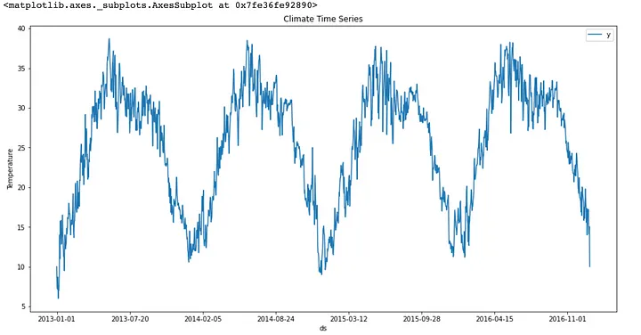

# Time Series

A time series is a series of data points indexed (or listed or grouped) in time order. Most commonly, a time series is a sequence taken at successively equally space points in time.

Or, time-series data is a dataset that tracks a sample over time and is collected regularly.

Examples:

- Commodity price
- Stock price
- House price
-  Weather records
- Company sales data
- Patient health metrics like ECG.

### The components of time-series data

Most time-series data can be decomposed into three components:

- trend
- seasonality
- noise

#### Tread

The data has a long-term movement is a series, whether it's upwards or downwards. It may be caused by population growth, inflation, environment change or the adoption of technology. Examples could be the long-term increase in the US stock market in the past ten years, and the growth in the real state market in mosts parts of the world in the past year, and the longevity of people's lives.

#### Seasonality

The data is correlated with calender-related efforts, whether it's weekly, monthly, or seasonally, and it's domain-specific. For examples, for most e-commerce platforms, their sales around December rise because of Christmas. In contrast, for real estate, the volumn of sold houses in the summer would be higher than in the winter in Canada because rople are reluctant to move around in the winter season.

#### Noise

Noise is also known as residues or irregulars. It's what remains after trend and seasonality are removed. It's short-term flucutation which is not predictable. Sometime noise can be dominant compared with treand and seasonality, making this kind of time series data harder to forecast. The stock price is a manifest example.

#### White noise

White noise is the exterme situation or noise that has no trends and seasonality. Therefore it's nearly impossible to predict, and it's a kind of stationary time-series data.

