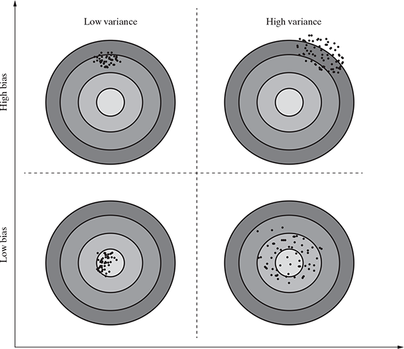

# Bias Variance Trade Off

In supervised learning, the class value assigned by the learning model built based on the training data may differ from the acutal class value. This error in learning can be of two types--errors due to 'bias' and error due to 'variance'.

### Errors due to 'Bias'

It is due to underfitting of the model.

Parameteric models generally have high bias making them easier to understand/interpret and faster to learn. These algorithms have poor performance on datasets, which are complex in nature and do not align with the  simplifying assumptions made by the algorithm. Underfitting results in high bias.

### Errors due to 'Variance'

Errors due to variance occur from difference in training data sets used to train the model. Different training data sets are used to train the model.

----------

- Increaing the bias will decrease the variance, and
- Increasing the variance will decrease the bias

----------

- Parametric algorithms are generally seem to demonstrate high bias but low variance.
- Non-parametric algorithms demonstrate low bias and high variance.

----------

The problems in training a models can either happend because either:

a. the model is too simple and hence fails to interpret the data grossly or
b. the model is extremely complex and magnifies even small differences in the training data.

As in above image, the best solution is to have a model with low bias as well as low variance. Hence, the goal of supervised machine learning  is to achieve a balance between bias and variance. The learning algorithm chosen and the user parameters which can be configured helps in striking a trade-off between bias and variance. For example, in a popular supervised algorithm *k*-Nearest Neighbors or *k*NN, the user configurable parameter '*k*' can be used to do a trade-off between bias and variance. In on hand, when the value of '*k*' is decreased, the model becomes simpler to fit and bias increase. On the other hand, when the value of 'k' is increased, the variance increases.