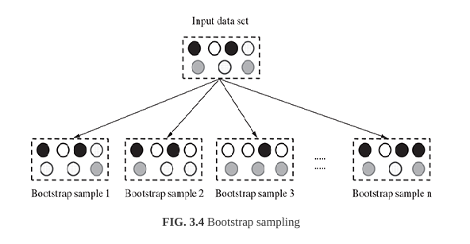

# Bootstrap Sampling

Bootstrap sampling or simply bootstrapping is a popular way to identify and test data sets from the input data set. It used the technique of Simple Random Sampling with Replacement (SRSWR), which is well known technique in sampling theory for drawing random samples.

Bootstrapping randomly picks data instances from the input data set, with the possibility of the same data instance to be picked mulitple times. This essentially means that from the input data set having '*n*' data instances, bootstrapping can create one or more training data sets having '*n*' data instances, some of the data instances being repeated multiple times.

This technique is particularly useful is case of input data sets of small size, i.e. having very less number of data instances.