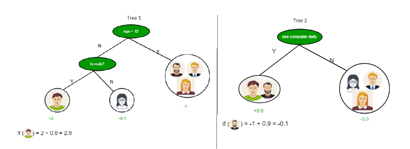

# Decision Tree in Machine Learning

A decision tree in machine learning is a versatile, interpretable algorithm used for prediction modelling. It structures decisions based on input data, making it suitable for both classification and regression tasks. 


### Decision Tree in Machine Learning

A decision tree is a type of superised learning algorithm that is commonly used in machine learning to model and predict outcomes based on input data. It is a tree-like structure where each internal node tests on attribute, each branch corresponds to attribute value and each leaf node represents the final decision or prediction. The decision tree algorithm falls under the category of supervised learning. They can be used to solve both regression and classfication problems.

####  Decision Tree Terminologies

There are specialized terms associated with decision trees that denote various components and facets of the tree structure and decision-making procedure:

- **Root Node**: A decision tree's root node, which represents the original choice or feature from which the tree branches, is the highest node.
- **Internal Nodes (Decision Nodes)**: Nodes in the tree whose choices are determined by the values of particular attributes. There are branches on these nodes that go to other nodes.
- **Leaf Nodes (Terminal Nodes)**: The branche's terminate, when choices or forecasts are decided upon. These are no more branches on leaf nodes.
- **Branches (Edges)**: Link between nodes that show how decisions are made in response to particular circumtances.
- **Splitting**: The process of driving a node into two more sub-nodes based on a decision criteria. It involves selecting a feature and threshold to create subsets of data.
- **Parent Node**: A node that is split into child nodes. The original node from which a split originates.
- **Child node**: Nodes created as a result of a split from a parent node.
- **Decision Criterion**: The rule or condition used to determine how the data should be split at a decision node. It involves comparing feature and a threshold to create subsets of data.
- **Pruning**: The process of removing branches or nodes from a decision tree to improve its generalisation and prevent overfitting.


#### How Decision Tree is formed?

The process of forming a decision tree involves recursively partitioning the data based on the value of different attributes. The algorithm selects the best attribute to split the data at each internal node, based on certain criteria such as information gain or Gini impurity. This splitting process continues until a stoping criterion is met, such as reaching a maximum depth or having number of instances in a leaf node.


#### Why Decision Tre?

Decision trees are widely used in machine learning for a number of reasons:

- Decision trees are so versatile in simulating intricate decision-making processes, because of their interpretablity and versatility.
- Their portrayal of complex choice scenarios that take into account a variety of causes and outcomes id made possible by their hierarchical structure.
- They provide comprehensible insights into the decision logic, decision trees are especially helpful for tasks involving categorisation and  regression.
- They are proficient with both numerical and categorial data, and they can easily adapt to a variety of datasets thanks to their autonomous feature selection capability.
- Decision trees also provide simple visualization, which helps to comprehend and elucidate the underlying decision processes in a model.


### Decision Tree Approach

Decision Tree uses the tree representation to solve the problem in which each leaf node corresponds to a class label and attributes are represented on the internal node of a tree.

We can represent any boolean function on discrete attributes using the decision tree.


###### Below are some assumptions that we made while using the decsion tree:

At the beginning, we consider the whole training set as the root:

- Feature values are preferred to be categorical. If the values are continous then they are discretized prior to building the model.
- On the basis of attribute values, records are distributed recursively.
- We use statistical methods for ordering attributes as root of the internal node.



As you can see from the above image the Decision Tree works on the Sum of Product form which is also known as *Disjunction Normal Form*. In the above image, we are predicting the use of computer in the daily life of people. In the Decision Tree, the major challenge is the identification of th attribute for the root node at each level. This process is known as attribute **Selection**. We have two popular attribute selection measures:


1. Information  Gain
2. Gini Index


#### 1. Information Gain

When we use a node in a decision tree to partition the training instances into smaller subsets the entropy changes. **Information is a measure of this change in entropy**.

- Suppose S is a set of instances.
- A is an attribute
- S<sub>v</sub> is the subset of S
- *v* represents an individual value that the attribute *A* can take and Values (A) is the set of all possible values of A, then


##### Entropy

It is the measure of uncertainty of a random variables, it characterizes the impurity of an arbitrary collection of examples. The higher the entropy more the information content.

Suppose S is a set of instances, A is an attribute, S<sub>v</sub> is the subset of S with A = v, and Values (A) is the set of all possible values of A, them


Example:

```
For the set X = {a,a,a,b,b,b,b,b}
Total instances: 8
Instances of b: 5
Instances of a: 3
```


#### Building Decision Tree using Information Gain The essentials

- Start with all training instances associated with the root node
- Use info gain to choose which attribute to label each node with
- *Note*: No root-to-leaf path should contain the same discrete attribute twice.
- Recusively construct each subtree on the subset of training instances that would classfied down the path in the tree.
- If all positive or all negative training instances remain, the label that node "yes" or "no" accordingly.
- If no attributes remain, label with a majority vote of training instances left at that node.
- If no instances remain, label with a majority vote of the parent's training instances.

**Example**: Now, let us draw a Decision Tree for the following data using Information gain. **Training set: 3 features and 2 classes**


Here, we have 3 features and 2 output classes. To build a decision tree using Information gain. We will each of the features and calculate the information for each feature.


Split on feature X


Split on features Y


Split on feature Z


From the above images, we can see that the information gain is maximum when we make a split on feature Y. So, for the root node best-suited feature is feature Y. Now we can see that while splitting the dataset by feature Y, the child contains a pure subset of the target variable. So we don't need to further split the dataset. The inal tree for the above dataset would look like this:

