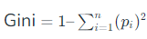
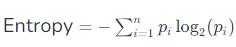
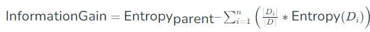

# Decision Tree

Decision trees are a popular and powerful tool used in various fields such as machine learning, data mining, and statistics. They provide a clear and intuitive way to make decisions based on data by modeling the relationships between different variables.

### What is Decision Tree?

A decision tree is a flowchart-like structure used to make decisions or predictions. It consists of nodes representing decicions or tests on attributes, branches representing the outcome of these decisions, and leaf nodes representing final outcomes or predictions. Each internal node corresponds to a test on an attribute, each branch corresponds to the result of the test, and each leaf node corresponds to a class lable or a continuous value.

### Structure of a Decision Tree

1. **Root Node**: Represents the entire dataset and initial decision to be made.
2. **Internal Nodes**: Represent decisions or tests on attributes. Each interal node has one or more branches.
3. **Branches**: Represents the outcomes of decision or test, leading to another node.
4. **Leaf Nodes**: Represents the final decisions or prediction. No further splits occur at these nodes.

### How Decision Tree Work?

The process of creating a decision tree involves:

1. **Selecting the Best Attributes**: Using metric like **Gini impurity**, **entropy**, or **information gain**, the best attribute to split the data is selected.
2. **Splitting the Dataset**: The dataset is split into subsets based on the selected attribute.
3. **Repeating the Process**: The process is repeated recursively for each subset, creating a new internal node or leaf node until a stopping criterion is met (e.g., all instances in a node belong to the same class or a predefined depth is reached).

### Metrics for Splitting

- **Gini Impurity**: Measures the likelihood of an incorrect classification of a new instance if it is was randomly classified according to the distribution of classes in the dataset.

where *pi* is the probability of an instance being classified into a particular class.

- **Entropy**: Measures the amount of uncertainty or impurity in the dataset.

where *pi* is the probability of an instance being classified into a particular class.

- **Information Gain**: Measures the reduction in entropy or Gini impurity after a dataset is split on an attribute.

where *Di* is the subset of *D* after splitting by an attribute.

### Advantages of Deicsion Trees

- **Simplicity and intepretability**: Decision trees are easy to understand and interpret. The visual representation closely mirrors human decision-making process.

- **Versatility**: Can be used for both classification and regression tasks.

- **No Need for Feature Scaling**: Decision trees do not require normalization or scaling of the data.

- **Handles Non-linear Relationships**: Capable of capturing non-linear relationships between features and target variables.

### Disadvantages of Decision Trees

- **Overfitting**: Decision trees can easily overfit the training data, especially if they are deep with many nodes.
- **Instability**: Small variations in the data can result in a completely different tree being generated.
- **Bias towards Features with More Levels**: Features with more levels can dominate the tree structure.

### Pruning 

To overcome **overfitting, pruning** techniques are used. Pruning reduces the size of the tree by removing nodes that provides little power in classifying instances. There are two main types of pruning.

- **Pre-pruning (Early Stopping)**: Stops the tree from growing once it meets certain certeria (e.g. maximum depth, minimum number of samples per leaf).
- **Postpruning**: Removes branches from a fully grown tree that do not provide significant power.

### Application  of Decision Trees

- **Business Decision Making**: Used in strategic planning and resource allocation.
- **Healthcare**: Assists in diagnosing diseases and suggesting treatment plans.
- **Finance**: Helps in credit scoring and risk assessment.
- **Marketting**: Used to segment customers and predict customer behavior.

[Introduction to Decision Tree in machine learning >>>](101-decision-tree-in-ml.md)

### Implementation

- [Decision Tree implementation ssing Scikit-Learn](../../1000-other/decision-tree/101-decision-tree.ipynb)