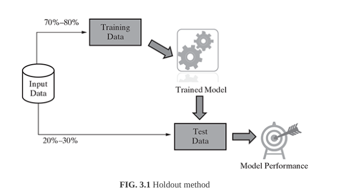

# Holdout Method

### Definition

The method of partitoning the input data into two parts - training and test data, which is by holding back a part of the input data for validating the trained model is known as holdout method.

### Explanation

A part of the input data is held back (that is how the name holdout originats) for evaluation of the model. This subset of the iniput data is used as the test data for evaluating the performancee of a trained model. In general 70%-80% of the input data (which is obviously labelled) is used for model training. The remaining 20%-30% is used as test data for validation of the performance of the model. However, a different proportion of dividing the input data into training and test datga is also acceptable. To make sure that the data is both the buckets are similar in nature, the division is done randomly. Random numbers are used to assign data itesm to the partitions.

Once the model is trained used the training data, the labels of the test data are predicted using the model's target function. Then the predicted value is compared with the actual value of the label. This is possible because the test data is a part of the input data with known labels. The performance of the model is in general measured by the accuracy of the prediction of the label value.

----------

In certain cases, the input data is partitioned into three portions -- a training and a test data, and a third validation data. The *validation data* is used in place of test data, for measuring the model preformance. It is used in iterations and to refine the model in each iteration. The *test data* is used only for once, after the model is refined and finalized, to measure and report the final performance of the model as a reference for future learning efforts.