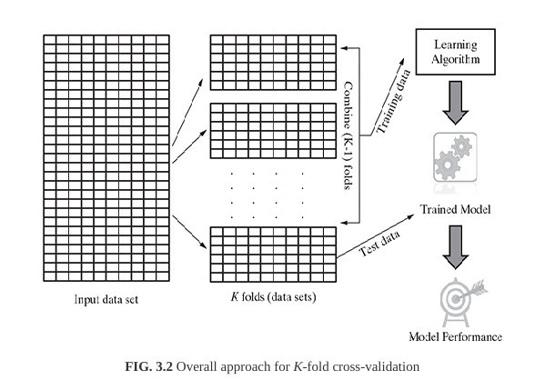
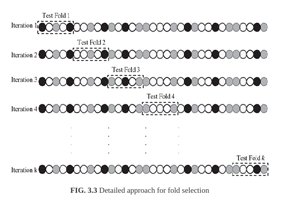

# K-fold Cross-validation Method

In *k*-fold cross-validation, the data set is divided into *k*-completely distinct or non-overlapping random partitions called folds.

----------

A special variant of holdout method, called repeated *holdout*, is sometimes employed to ensure the randomness of the composed data sets. In repeated holdout, several random holdouts are used to measure the model performance. In the end, the average of all performances is taken.

As multiple holdouts have been drawn, the training and test data (and also validation data, in case it is drawn) are more likely to contain representative data from all classes and resemble the original input data closely. This process of repeated holdout is the basis of *k*-fold corss validation technique.

### Two popular approaches

1. [10-fold cross-validation](#10-fold-cross-validation) (10-fold CV)
2. [Leave-one-out cross-validation](#leave-one-out-cross-validation-loocv) (LOOCV)

#### 10-fold Cross Validation

In this approach, for each of the 10-folds, each comprising of approximately 10% of the data, one of the folds is used as the test data for validating model performance trained based on the remaining 9 folds (or 90% of the data). This is repeated 10 times, once for each of the 10 folds being used as the test data and the remaing folds as the training data. The average performance across all folds is being reported.

#### Leave-one-out cross-validation (LOOCV)

It is an extreme case of *k*-fold cross validation using one record or data instance at a time as a test data. This is done to maximize the count of data used to train the model. *The number of iterations for which it has to run is equal to the total number of data in the input data set*. Hence, obviously, it is computationally very expensive and not used much.