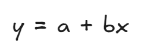
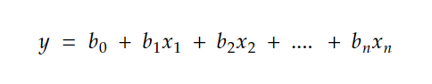
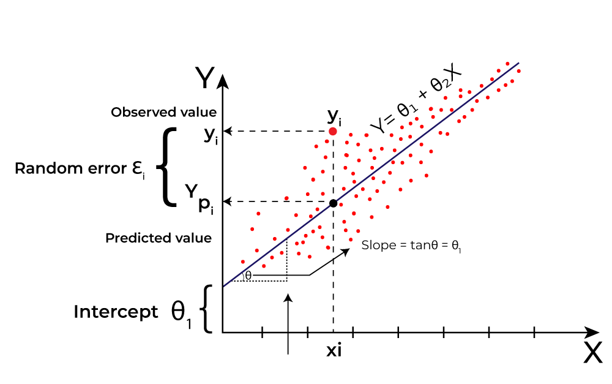
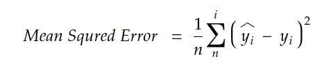

# Linear Regression

Linear regression is a type of [supervised machine learning](https://) algorithm that computes the linear relationship between the dependent variable and one or more independent variables by fitting a linear equation to observed data.

When there is only one independent feature, it is known as **Simple Linear Regression**, and when there are more than one feature, it is known as **Multiple Linear Regression**.

Similarly, when there is only one dependent variable, it is considered **Univariate Linear Regression**, while when there are more than one dependent variables, it is known as **Multivariate Regression**.

### Importance of linear regression

- Linear regression equation provides clear coefficients that elucidate the impact of each independent variable on the dependent variable, facilitating a deeper understanding of the underlying dynamics.
- Linear regression is transparent, easy to implement, and serves as a foundation concept for more complex algorithms.
- Techniques like **regularization** and **Support vector machines** draw inspiration from linear regression, expanding its utility.
- Linear regression is a conerstone in assumption testing, enabling researchers to validate key assumptions about the data.

### Types of linear regression

Two mains type of linear regression:

- [Simple linear regression](simple-linear-regression.md)
- [Mulitple linear regression](multiple-linear-regression.md)

#### Simple Linear Regression

This is the simplest form of linear regression, and it involves only one independent variable and one dependent variable. The equation of simple linear regression is:

where:

- y is the dependent variable
- x is the independent variable
- a is the intercept
- b is the slope

#### Multiple Linear Regression

Mulitple Linear Regression involves more than one independent variable and one dependent variable. The equation for mulitple linear regression is:

- y is the dependent variable
- x1, x2, ..., xn are the independent variable
- b0 is the intercept
- b1, b2, ..., xn are the slopes

The goal of the algorithm is to find the best fit line equation that can predict the values based on the independent variables.

### What is best Fit line?

Our primary objective while using linear regression is to locate the best-fit line, which implies that the error between the predicted and actual values should be kept to a minimum. There will be the least error in the best-fit line.

The best fit line equation provides a stright line that represents the relationship between the dependent and independent variales. The slope of the line indicates how much the dependent variable changes for a unit change in the independent variable(s).

Here,
- Y is dependent variable (or target variable)
- X is independent variable (or predictor of Y)

Linear regression performs the task to predict a dependent variable (y) based on a given independent variable (x). In the figure above, X (input) is the work experience and Y (output) is the salary of a person. The regression line is the best fit line of our model.

The distance between the actual value and the fitted or predicted value, is known as **residual**. The regression model can be considered to be fitted well if the difference between acutal and predicted value, i.e. the residual value is less.

### Cost function for Linear Regression

The [cost function](cost-function.md) or the [loss function](loss-function.md) is nothing but the error or difference between the predicted value and the true value.

In linear regression, the **Mean Squared Error (MSE)** cost function is employed, which calculates the average of the squared error between the predicted values (^yi) and the actual values (yi).

