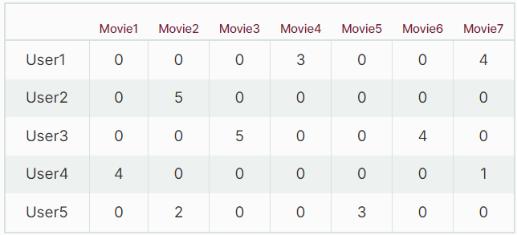
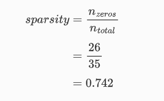
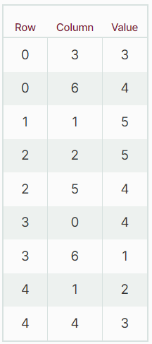

# Sparse Matrix

A sparse matrix is a special case of a matrix in which the number of zero elements is much higher than the number of non-zero elements. As a rule of thumb, if 2/3 of the total elements in a matrix are zeros, it can be called a sparse matrix. Using a sparse matrix representation--where only the non-zero values are stored--the space used for representing data and the time for scanning the matrix are reduced significantly

### Application of Sparse Matrix.

- **Natural Language processing**: The occurence of words in document can be represented in sparse matrix. The words in a document are only a small subset of words in a language. If we have a row for every document and a column for every word, then storing the number of words occurrences in a document has a high percentage of zeros in every column.

- **Recommemdation System**: A sparse matrix can be employed to represent whether any particular user has watched any movie.

- **Market Basket Analysis**: Since the number of purchased items is tiny compared to the number of non-purchased items, a sparse matrix is used to represent all products and customers.

### Example 1

Let's take the example of a movie recommendation system. There are millions of users and thousands of movies, so it's not possible for users to watch and rate all movies. This data can be represented as a matrix where the rows are the users, and the columns are the movies.

Most of the matrix elements will be empty, where the missing values will be replaced with zeros. Since a small percentage of the matrix has non-zero values, this matrix can be considered a sparse matrix. A small portion of the data is given below:

The sparsity of this matrix can be calculated by obtaining the ratio of zero elements to total elements. For this example, sparsity is calculated as:

It can be seen that the number of zeros in a sparse matrix is very high. Representing all zero values in a matrix like this would result in high memory usage, so in practice, only non-zero values of the sparse matrix are stored.

### Example 2

Another example would be to use a matrix to represent the occurrence of words in documents. The term-document matrix dimension will be *n x m*, where *n* is the number of documents and *m* is the number of words in the language model. As a result, most of the matrix elements will be zero since only non-zero values are important for data analysis. In addition to a large amount of space used, there will be a computational time problem because all elements will be scanned to access non-zero elements. This process yields a computational complexity problem.

To overcome these problems, we can use different data structures to represent a sparse matrix. One common representation format for a sparse matrix is a *Coordinate list (COO)*, which uses three-element tuples to store non-zero values' coordinates in a matrix. For example, the following table can be constructed to represent a sparse term-document matrix:

### Sparse Matrix in Python

The Scipy library provides the `scipy.sparse` package to create and manipulate sparse matrix.

[A simple sparse matrix](ipynb/sparse-matrix.ipynb)