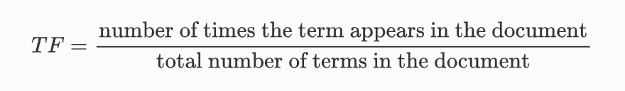
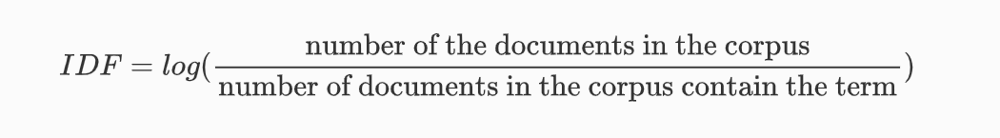
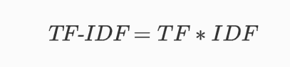
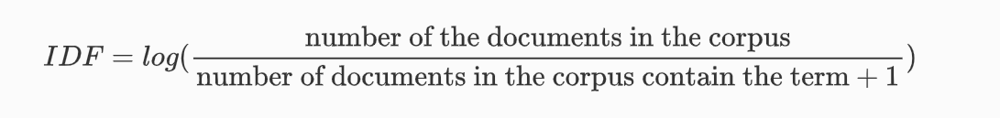

# What is  TF-IDF?

Term Frequency - Inverse Document Frequency (TF-IDF) is a widely used statistical method in natural language processing and informal retreival. It measures how important a term in within a document relative to a collection of documents (i.e., relative to a corpus).

Words within a text are transformanced into importance numbers by a text vectorization process. 

As its name implies, TF-IDF vectorizes/scores a word by mulitplying the word's Term Frequency (TF) wit the Inverse Document Frequency (IDF).

### Term Frequency (TF)

**TF** of a term is the number of times the term appears in a document compared to the total number of words in the document.




### Inverse Document Frquency (IDF)

**IDF** of a term reflects the proportion of documents in the corpus that contain the term. Words unique to a small percentage of documents (e.g., technical jargon terms) receive higher importance values than words common across all documents (e.g., a, the, and).



### TF-IDF

The **TF-IDF** of a term is calculated by multiplying TF and IDF scores.



Translated into plain English, importance of a term is high when it occurs a lot in a given document and rarely in others. In short, commonality with a document measured by TF is balanced by rarity between documents measured by IDF. The resulting TF-IDF score reflects the importance of a term for a document in the corpus.


TF-IDF is useful in many natural language processing applications. For examples Search Engines use TF-IDF to rank the relevance of the document for a query. TF-IDF is also employed in text classification, text-summarization, and topic modelling.

Note that there are some different approaches to calculating the IDF score. The base 10 logarithm is often used in the calculation. However, some libraries use a natural logarithm. It Addition, one can be added to the denominator as follows in order to avoid division by zero.




### Numerical Example

Imagine the term *t* appears 20 times in a document that contains a total of 100 words. Term Frqeuency (TF) of *t* can be calculated as follows:


```
TF = 20/100 = 0.2
```

Assume a collection of related documents contains 10000 document. If 1000 documents out of 10,000 documents contain the term *t*. Inverse Document Fequency (IDF) of *t* can be calculated as follows:

```
IDF = log(10000/1000) = 1
```

Using these two quantities, we can calculate TF-IDF score of the term *t* for the document.

```
TF-IDF = 0.2 * 1 = 0.2
```

### Implementation

[Ipynb file](ipynb/tfidf.ipynb)